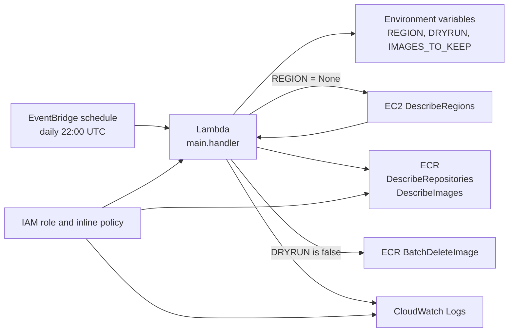
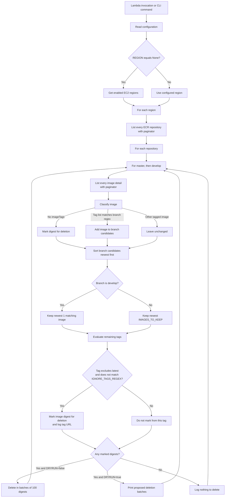

# ECR Cleanup Lambda architecture

## Purpose

This repository deploys and can also run a Python Lambda that finds old Amazon
ECR image manifests and optionally deletes them. The cleanup policy is based on
ECR image tags that match the hard-coded branch names `master` and `develop`.
It is **not** a general unused-image detector: the current code makes no ECS,
container, deployment, or task-definition calls.

## Components

| Component | Responsibility |
| --- | --- |
| `lambda-cloudformation.yaml` | AWS SAM template for the scheduled Lambda, its execution role, and its inline policy. |
| EventBridge schedule | Invokes the Lambda daily at `22:00 UTC` (`cron(0 22 * * ? *)`). |
| `main.py` | Lambda handler, repository/image discovery, retention calculation, dry-run reporting, and deletion. It can also be run from the command line. |
| Amazon EC2 API | When `REGION=None`, supplies the enabled regions to scan. |
| Amazon ECR API | Lists repositories and image details, then deletes selected image digests. |
| CloudWatch Logs | Receives Lambda `print` output and API deletion responses. |

## Deployed topology

The SAM template allocates 128 MB and a 300-second timeout. The Lambda's role
uses an inline policy with broad (`Resource: "*"`) ECR and legacy ECS read
permissions, plus CloudWatch Logs write access.

## Execution flow

## Retention and selection rules

1. Every repository is processed; there is no repository allowlist, prefix, or
   exclusion setting.
2. Each repository is scanned twice: once for `master`, then for `develop`.
   A tag matches when the branch text occurs anywhere in the string form of its
   tag list, so matching is a substring test rather than an exact tag format.
3. Untagged image digests are candidates for deletion immediately.
4. Matching tagged images are ordered by `imagePushedAt`, newest first.
   `master` retains the newest `IMAGES_TO_KEEP` images (default `100`);
   `develop` always retains only its newest one.
5. Older matching tags containing `latest`, or matching
   `IGNORE_TAGS_REGEX`, are not selected through that tag. Other older tags
   mark the whole image digest for deletion.
6. A digest is added only once and ECR deletion requests contain at most 100
   digests.

Deletion happens at the image-digest level, not the individual-tag level. As a
result, deleting a selected digest removes the manifest and all of its tags.

## Configuration and entry points

| Setting | Default in `main.py` | Template value | Effect |
| --- | --- | --- | --- |
| `REGION` | `None` | `None` | A named AWS region scans only that region. The literal string `None` scans all regions returned by EC2. |
| `DRYRUN` | `false` | `True` | Only the literal value `false` permits deletion; every other value is treated as dry run. The deployed template is therefore safe by default. |
| `IMAGES_TO_KEEP` | `100` | `100` | Number of newest matching `master` images retained; ignored for `develop`, which keeps one. |
| `IGNORE_TAGS_REGEX` | `^$` | not set | Regular expression for tags excluded from retention-based selection. It is available through the CLI or an externally supplied Lambda environment variable. |

The same `handler(event, context)` is used by Lambda and by the CLI harness.
The event payload itself is not read. CLI arguments populate the corresponding
environment variables before invoking the handler.

## AWS API and permission mapping

| Code path | API used | Policy status |
| --- | --- | --- |
| All-regions discovery | `ec2:DescribeRegions` | **Missing** from the supplied policy. A deployment using `REGION: None` needs this permission. |
| Repository discovery | `ecr:DescribeRepositories` | Granted. |
| Image discovery | `ecr:DescribeImages` | Granted. |
| Deletion | `ecr:BatchDeleteImage` | Granted. |
| Logging | CloudWatch Logs create/write actions | Granted. |
| ECS reads | Several `ecs:*` describe/list actions | Granted but unused by current code. |
| `ecr:ListImages` | Not called by current code | Granted but unused. |

## Operational notes and current limitations

- The README describes protection for images used by running ECS tasks, but that
  logic was removed in the current implementation. Do not rely on this Lambda
  to protect deployed or running image digests.
- The all-regions default cannot work with the supplied IAM policy until
  `ec2:DescribeRegions` is added. A single configured `REGION` avoids that API
  call.
- Deletion can occur after the `master` pass, before the `develop` pass. Since
  untagged digests are collected during each pass, the first pass can delete
  them immediately.
- `latest` and ignored tags are evaluated per tag, but the API deletes a whole
  digest. A multi-tagged image can therefore be deleted when one qualifying
  older tag marks its digest even if it also carries a protected-looking tag.
- A failed ECR/EC2 API call, invalid regular expression, or invalid
  `IMAGES_TO_KEEP` value is not handled locally; it fails the invocation.
- There are no automated tests, deployment pipeline files, alarms, metrics, or
  deletion notifications in this repository.

## Safe operating sequence

1. Deploy or run with `DRYRUN=True` and inspect CloudWatch/console output.
2. Confirm the selected digest and tag list against the repositories that must
   be retained.
3. Set a specific `REGION` unless the IAM policy has been updated for
   all-region discovery.
4. Change `DRYRUN` to the exact string `false` only after the proposed
   deletions are approved.
