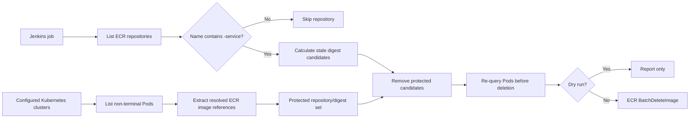

# Kubernetes active-image protection

## Objective and safety contract

The Jenkins cleanup job will only process ECR repositories whose names contain
`-service`. It will protect every ECR digest used by an active Kubernetes Pod.

For this feature, an active Pod is any non-terminal Pod: `Pending`, `Running`,
or `Unknown`. The inventory includes normal, init, and ephemeral containers.
`Succeeded` and `Failed` Pods do not protect images.

The implementation must fail closed:

- A non-dry-run invocation requires one or more Kubernetes targets.
- Any Kubernetes target failure (unreachable API, invalid token, TLS error, or
  failed Pod query) aborts the whole job before `BatchDeleteImage` is called.
- The job fetches the Pod inventory again immediately before every real delete.
- TLS verification is mandatory; `--insecure-skip-tls-verify` is never used.
- Jenkins must prevent concurrent executions of this cleanup job.

ECR and Kubernetes have no shared transaction. A new Pod can theoretically
start after the final Pod query and before ECR receives the delete request.
The recheck and fail-closed policy make the cleanup safe for all known active
Pods, but cannot eliminate that distributed race. A future enhancement should
also protect images referenced by desired workload definitions (for example, a
Deployment scaled to zero).

## Design flow



Deletion remains digest-based. Since deleting an ECR digest removes all tags
that reference that manifest, protection must compare repository and digest,
not only a mutable tag.

## Prerequisites

| Item | Required use |
| --- | --- |
| Jenkins agent and Python 3 virtual environment | Runs the cleanup program. |
| `boto3` | Calls ECR and EKS. |
| `kubernetes` Python package | Calls Kubernetes directly without shelling out to `kubectl`. |
| `pytest` and `pytest-cov` | Enforce the required 95% coverage gate. |
| AWS identity/profile | Reads ECR and retrieves the EKS endpoint and CA. |
| ServiceAccount token per cluster | Authenticates the read-only Kubernetes call. |
| Non-secret target JSON | Maps each cluster name, region, profile, and token environment-variable name. |

The Jenkins AWS identity needs the following minimum actions for each relevant
account:

```text
ecr:DescribeRepositories
ecr:DescribeImages
ecr:BatchDeleteImage
eks:DescribeCluster
```

`ecr:BatchDeleteImage` must not be granted to dry-run-only jobs.

## Cluster setup

Perform this setup once for each cluster that can run an image from a cleanup
eligible repository.

### 1. Verify EKS access and endpoint reachability

The script will call `eks:DescribeCluster` to retrieve the endpoint and
base64-encoded CA certificate dynamically. The CA does not need to be stored
in Jenkins.

```bash
aws eks describe-cluster \
  --name example-production \
  --region us-east-1 \
  --profile example-profile \
  --query 'cluster.{status:status,endpoint:endpoint,public:endpointPublicAccess,private:endpointPrivateAccess}' \
  --output json
```

For private EKS API endpoints, the Jenkins agent needs VPC/private-network
connectivity. For public endpoints, restrict EKS public-access CIDRs to the
Jenkins egress range where practical.

### 2. Deploy a read-only ServiceAccount

Apply [`kubernetes/ecr-cleanup-reader.yaml`](kubernetes/ecr-cleanup-reader.yaml)
in every target cluster. Its contents are:

```yaml
apiVersion: v1
kind: Namespace
metadata:
  name: ecr-cleanup
---
apiVersion: v1
kind: ServiceAccount
metadata:
  name: ecr-cleanup-reader
  namespace: ecr-cleanup
---
apiVersion: rbac.authorization.k8s.io/v1
kind: ClusterRole
metadata:
  name: ecr-cleanup-pod-reader
rules:
  - apiGroups: [""]
    resources: ["pods"]
    verbs: ["get", "list"]
---
apiVersion: rbac.authorization.k8s.io/v1
kind: ClusterRoleBinding
metadata:
  name: ecr-cleanup-pod-reader
subjects:
  - kind: ServiceAccount
    name: ecr-cleanup-reader
    namespace: ecr-cleanup
roleRef:
  apiGroup: rbac.authorization.k8s.io
  kind: ClusterRole
  name: ecr-cleanup-pod-reader
```

This grants read-only Pod discovery. Do not grant Secret, workload-edit, exec,
or cluster-admin privileges.

### 3. Issue and store a token

For a manual test, an administrator can issue a short-lived token:

```bash
kubectl -n ecr-cleanup create token ecr-cleanup-reader --duration=1h
```

Store the result as Jenkins **Secret Text** and bind it as a masked variable,
such as `K8S_TOKEN_EXAMPLE_PRODUCTION`. Do not echo it or enable shell tracing
with `set -x`.

For scheduled jobs, automate token rotation through an approved credential
management process. Long-lived ServiceAccount token Secrets are an interim
option only; they need documented rotation and immediate revocation procedures.

### 4. Validate TLS, token, and RBAC

Use the target token on a terminal that has the specified AWS profile:

```bash
CLUSTER_NAME="example-production"
REGION="us-east-1"
PROFILE="example-profile"
CA_FILE="$(mktemp)"

trap 'rm -f "$CA_FILE"' EXIT
ENDPOINT="$(aws eks describe-cluster --name "$CLUSTER_NAME" --region "$REGION" --profile "$PROFILE" --query 'cluster.endpoint' --output text)"
aws eks describe-cluster --name "$CLUSTER_NAME" --region "$REGION" --profile "$PROFILE" --query 'cluster.certificateAuthority.data' --output text | base64 --decode > "$CA_FILE"

kubectl --server="$ENDPOINT" --certificate-authority="$CA_FILE" --token="$K8S_TOKEN_EXAMPLE_PRODUCTION" auth can-i list pods --all-namespaces
kubectl --server="$ENDPOINT" --certificate-authority="$CA_FILE" --token="$K8S_TOKEN_EXAMPLE_PRODUCTION" get pods --all-namespaces -o json >/dev/null
```

Both commands must succeed before a non-dry-run cleanup is enabled.

## Multi-infrastructure target configuration

Commit a non-secret JSON target file. Do not put bearer tokens in source
control; `token_env` names the Jenkins environment variable containing each
token.

`k8s-targets.json`:

```json
[
  {
    "cluster_name": "example-production",
    "region": "us-east-1",
    "aws_profile": "example-profile",
    "token_env": "K8S_TOKEN_EXAMPLE_PRODUCTION"
  },
  {
    "cluster_name": "another-production-cluster",
    "region": "us-west-2",
    "aws_profile": "example-profile",
    "token_env": "K8S_TOKEN_ANOTHER_PRODUCTION"
  }
]
```

The code uses a separate boto3 session when `aws_profile` is present. A
cross-account target requires an approved profile or assumed role that grants
`eks:DescribeCluster` in that target account. ECR scan and Kubernetes target
regions are separate because a cluster can run images from a different region.

## Job interface

The CLI retains existing retention arguments and adds:

```text
--k8s-targets-file k8s-targets.json
--repository-name-contains -service
--protect-active-pod-images
```

`-service` is the production default. Both Kubernetes options are required for
`-dryrun false`. A dry run without them may inspect old retention logic but
must state that active-image protection is disabled.

```bash
./venv/bin/python main.py \
  -dryrun false \
  -imagestokeep 5 \
  -region YOUR_ECR_REGION \
  --repository-name-contains=-service \
  --k8s-targets-file k8s-targets.json \
  --protect-active-pod-images
```

## Implementation design

### Phase 1: refactor into testable units

| Module | Responsibility |
| --- | --- |
| `ecr_cleanup/config.py` | CLI and target-file validation. |
| `ecr_cleanup/models.py` | Immutable target and repository/digest values. |
| `ecr_cleanup/ecr.py` | Eligible repository discovery, image discovery, and batched deletion. |
| `ecr_cleanup/kubernetes.py` | EKS endpoint/CA retrieval, Kubernetes API connection, Pod pagination, and active image parsing. |
| `ecr_cleanup/cleanup.py` | Candidate calculation, protection, recheck, fail-closed deletion orchestration. |
| `main.py` | Thin command-line entry point. |

Preserve existing branch-retention semantics unless they are separately
approved for redesign. Crucially, move deletion outside the current
`master`/`develop` loop so candidates are protected before any delete occurs.

### Phase 2: ECR candidate handling

1. Filter the `describe_repositories` paginator using
   `repository_name_contains`.
2. Log skipped repository names and the effective filter.
3. Build candidate digests once per repository.
4. Represent a candidate as registry ID, repository name, repository URI, and
   digest.
5. Retain ECR's limit of 100 digests per delete request.

### Phase 3: Kubernetes image inventory

1. Validate each target and read its named token environment variable without
   logging the value.
2. Call `eks:DescribeCluster` through the target boto3 session.
3. Configure a Kubernetes client with the returned endpoint, decoded CA, and
   bearer token. Use a restrictive temporary CA file and remove it in `finally`.
4. Use paginated `list_pod_for_all_namespaces`; retain non-terminal Pods only.
5. Inspect `container_statuses`, `init_container_statuses`, and
   `ephemeral_container_statuses`.
6. Pair every status with its spec container by name. Normalize the spec image
   and resolved `image_id` to an ECR repository URI plus `sha256` digest.
7. Support known runtime prefixes, including `docker-pullable://` and
   `containerd://`. If an active ECR image cannot be normalized safely, abort
   rather than risk deleting it.

### Phase 4: protection and deletion

1. Union protected repository/digest values across all target clusters.
2. Subtract protected values from stale ECR candidates.
3. In dry-run output, show candidate, protected, skipped, and final-delete
   counts, including cluster/namespace/Pod origin for protected digests.
4. Immediately before a real delete, fetch the Pod inventory again and repeat
   the protection calculation.
5. On any recheck failure, exit non-zero without deletion.
6. Delete only remaining digests and return non-zero on ECR failures.

## Required tests and coverage gate

Add these development dependencies:

```text
pytest
pytest-cov
```

Mock ECR, EKS, and Kubernetes clients; tests must never contact AWS or a live
cluster.

| Test area | Minimum cases |
| --- | --- |
| Repository filtering | `-service` matches, non-matches skip, paginated results. |
| Target configuration | Multiple targets, malformed target, missing token variable, profile selection. |
| EKS setup | Endpoint/CA decoding, missing CA, TLS verification enabled. |
| Pod selection | `Pending`/`Running`/`Unknown` protect; terminal Pods do not. |
| Container variants | Normal, init, and ephemeral statuses protect a digest. |
| Reference parsing | ECR tags/digests, runtime prefixes, non-ECR images, malformed active ECR references fail closed. |
| Multi-cluster protection | Union works; same digest in another repository does not protect the wrong repository. |
| Fail-closed behavior | Any target/inventory/recheck error makes zero ECR delete calls. |
| ECR deletion | Dry run deletes nothing; only unprotected values delete; batch size is at most 100; partial failures exit non-zero. |
| Regression | Branch retention, `latest`, ignore regex, untagged images, and keep count behavior. |

Add a strict coverage configuration:

```ini
[pytest]
addopts = -q --cov=ecr_cleanup --cov=main --cov-report=term-missing --cov-fail-under=95
testpaths = tests
```

Jenkins must run this before dry-run or deletion:

```bash
./venv/bin/python -m pytest
```

## Acceptance criteria

- Non-`-service` repositories make no ECR image-discovery or deletion calls.
- Every digest reported by a non-terminal Pod in any configured target is
  excluded from deletion.
- Any Kubernetes inventory failure makes no `BatchDeleteImage` call.
- Every actual delete has a fresh Pod inventory recheck.
- Tokens never appear in logs, command arguments, source control, or target
  JSON files.
- All tests pass with at least 95% production Python line coverage.
- The first deployment in every infrastructure runs in dry-run and its
  protected-digest report is reviewed before deletion is enabled.
